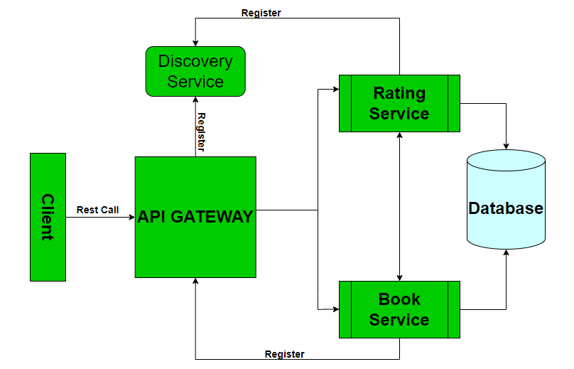
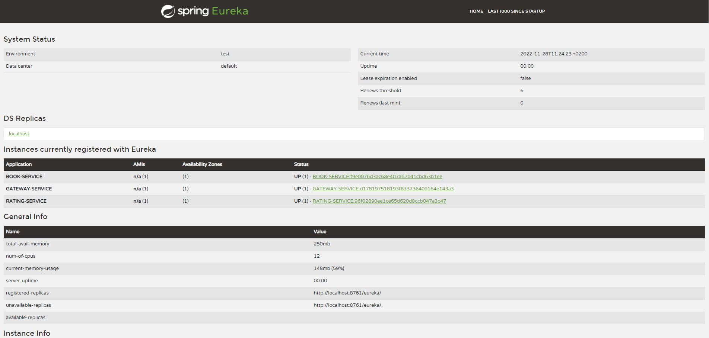
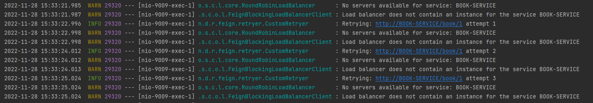
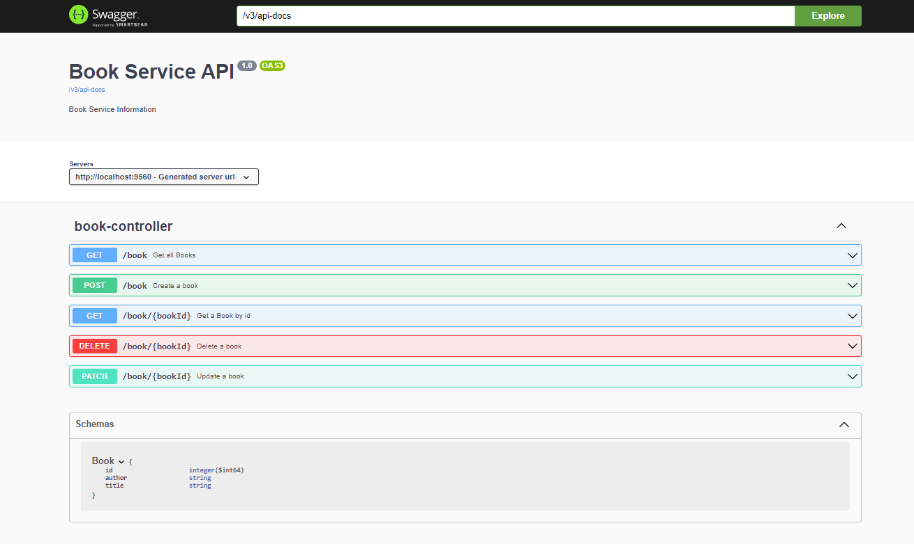
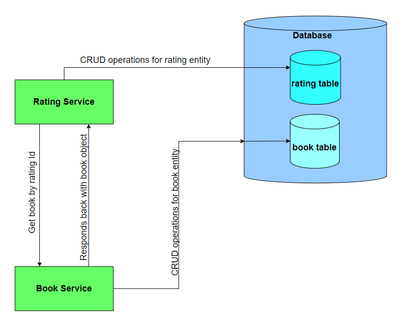

# Spring Cloud Microservices

## Microservices Architecture



The project structure is made up of:

- Rating/Book services which are Spring Boot based projects which performs CRUD operations.
- API Gateway from Spring Cloud family.
- Eureka Discovery Service which hold the information about all client-service applications.
- PostgreSQL for persisting the data.

## Project Structure

Spring cloud microservices project is a maven multi-module project with shared dependencies inside parent ```pom.xml```
and individual dependencies inside each service ```pom.xml```.

```
spring-cloud-microservices (root directory)
    - book-service
        pom.xml
    - rating-service
        pom.xml
    - gateway
        pom.xml
    - discovery-service
        pom.xml
    pom.xml (root)
```

```
<modules>
    <module>discovery-service</module>
    <module>rating-service</module>
    <module>book-service</module>
    <module>gateway</module>
</modules>
```

## Library Integration

### Spring Boot

Since it's a spring boot based project, the main dependency is ```spring-boot-starter-parent``` with version ```2.7.4```
.

```
<parent>
    <groupId>org.springframework.boot</groupId>
    <artifactId>spring-boot-starter-parent</artifactId>
    <version>2.7.4</version>
    <relativePath/> <!-- lookup parent from repository -->
</parent>
```

### Spring Cloud Eureka

All of the components are registered via eureka discovery service.

```
<dependency>
        <groupId>org.springframework.cloud</groupId>
        <artifactId>spring-cloud-starter-netflix-eureka-server</artifactId>
</dependency>
```

Registration of each services is done by ```application.properties``` configuration.

```
    spring.application.name=RATING-SERVICE
    
    #Publish Application(Register with Eureka)
    eureka.client.service-url.default-zone=http://localhost:8761/eureka
    
    # instance id for eureka server
    eureka.instance.instance-id=${spring.application.name}:${random.value}
    spring.datasource.url=jdbc:postgresql://localhost:5433/cloud
```




### Feign Rest Client

The client used for http communications is FeignClient.Feign is a declarative web service client. It makes writing web
service clients easier. To use Feign create an interface and annotate it.

```
<dependency>
    <groupId>org.springframework.cloud</groupId>
    <artifactId>spring-cloud-starter-openfeign</artifactId>
</dependency>
```

Book Feign Client sample:

```
@FeignClient(name = "BOOK-SERVICE", decode404 = true)
public interface BookRestConsumer {

	@GetMapping(value = "/book/{bookId}", produces = MediaType.APPLICATION_JSON_VALUE,
			consumes = MediaType.APPLICATION_JSON_VALUE)
	Book getBookById(@PathVariable Long bookId) throws BookNotFoundException;

}
```

#### Feign Retry Mechanism

The microservice handling persisting Ratings and calling the book client has retry mechanism enabled.The retries are done if connection errors occurs and it can retry up to 3 times with a backOff policy between retries of 1000 ms.

```
private final int maxAttempts;

	private final long backoff;

	int attempt;

	/**
	 * Waits for 10 second before retrying.
	 */
	public CustomRetryer() {
		this(1000, 3);
	}

	public CustomRetryer(long backoff, int maxAttempts) {
		this.backoff = backoff;
		this.maxAttempts = maxAttempts;
		this.attempt = 0;
	}

	public void continueOrPropagate(RetryableException e) {

		if (attempt++ >= maxAttempts) {
			throw e;
		}

		try {
			TimeUnit.MILLISECONDS.sleep(backoff);
		}
		catch (InterruptedException ex) {

		}

		log.info("Retrying: " + e.request().url() + " attempt " + attempt);
	}

	@Override
	public Retryer clone() {
		return new CustomRetryer(backoff, maxAttempts);
	}
```


Response example in case of unsuccesfull retry:
```
Service unavailable at the moment, please try again later.
```



#### Feign Error Decoder

The FeignClient has an error decoder which returns an Retryable Exception in case 503/408 http statuses.

```
@Override
public Exception decode(String methodKey, Response response) {

		if (response.status() == HttpStatus.SERVICE_UNAVAILABLE.value()
				|| response.status() == HttpStatus.REQUEST_TIMEOUT.value()) {

			return new RetryableException(response.status(), methodKey, null, new Date(System.currentTimeMillis()),
					response.request());
		}
		return defaultErrorDecoder.decode(methodKey, response);

	}
```

#### FeignClient configurations

Inside ```application.properties``` we have the configuration for feign client as follows:

```
feign.client.config.default.error-decoder=net.dg.ratingservice.feign.errordecoder.FeignErrorDecoder
feign.client.config.default.connectTimeout=6000
feign.client.config.default.readTimeout=6000
``` 

For the error decoder, we specify the package of error decoder.
Connection timeout and readTimeout is the time needed for the TCP handshake, while the read timeout needed to read data from the socket, if the time exceeds, retry mechanism will start.

### Spring Cloud Gateway

This project provides a library for building an API Gateway on top of Spring WebFlux. Spring Cloud Gateway aims to provide a simple, yet effective way to route to APIs and provide cross cutting concerns to them such as: security, monitoring/metrics, and resiliency.

Since we are using spring cloud gateway, we need also dependency for reactive applications.WebFlux is a Spring reactive-stack web framework. It was added to Spring 5. It is fully non-blocking, supports reactive streams back pressure, and runs on such servers such as Netty, Undertow, and Servlet 3.1+ containers. Spring WebFlux is an alternative to the traditional Spring MVC
```
<dependency>
    <groupId>org.springframework.boot</groupId>
    <artifactId>spring-boot-starter-webflux</artifactId>
</dependency>
<dependency>
    <groupId>org.springframework.cloud</groupId>
    <artifactId>spring-cloud-starter-gateway</artifactId>
</dependency>
```

### Spring Boot Data JPA & PostgreSQL

Spring Boot JPA is a Java specification for managing relational data in Java applications.

```
<dependency>
    <groupId>org.springframework.boot</groupId>
    <artifactId>spring-boot-starter-data-jpa</artifactId>
</dependency_>
```

For storing the data we use a relational database, <strong>PostgreSQL</strong>.

```
<dependency>
    <groupId>org.postgresql</groupId>
    <artifactId>postgresql</artifactId>
</dependency>
```

```
@Entity
@Data
@NoArgsConstructor
@AllArgsConstructor
public class Rating {

	@Id
	@GeneratedValue(strategy = GenerationType.IDENTITY)
	private Long id;

	private Long bookId;

	private int stars;

}
```

### JUnit 5

JUnit is a unit testing framework for the Java programming language.

```
<dependency>
    <groupId>org.junit.jupiter</groupId>
    <artifactId>junit-jupiter-api</artifactId>
</dependency>
```

```
@WebMvcTest(RatingValidationService.class)
class RatingValidationServiceTest {

	@Autowired
	RatingValidationService ratingValidationService;

	@Test
	void whenExceptionThrown_thenRuleIsApplied() {
		assertThrows(ValidationException.class, () -> ratingValidationService.validate(new Rating(null, null, 0)));

		assertThrows(ValidationException.class, () -> ratingValidationService.validate(new Rating(null, null, 10)));
	}

}
```

### Integration Testing

Integration testing is done with the help of <strong>WebMvcTest</strong> for testing the controllers.


```
@WebMvcTest(RatingController.class)
class RatingControllerTest {

	@Autowired
	MockMvc mockMvc;

	@Autowired
	ObjectMapper objectMapper;

	@MockBean
	RatingServiceImpl ratingService;

	@MockBean
	RatingRepository ratingRepository;

	@MockBean
	RatingValidationService ratingValidationService;

	@Test
	void testCreateRatingThenReturnisCreatedStatusCode() throws Exception {

		Rating rating = RatingObjectMother.buildRating();

		mockMvc.perform(MockMvcRequestBuilders.post("/rating").content(objectMapper.writeValueAsString(rating))
				.contentType(MediaType.APPLICATION_JSON)).andExpect(status().isCreated());
	}
...........
}
```

### Archunit

ArchUnit is library for checking the architecture of Java code using any plain Java unit test framework.

```
<dependency>
    <groupId>com.tngtech.archunit</groupId>
    <artifactId>archunit</artifactId>
    <version>0.14.1</version>
    <scope>compile</scope>
</dependency>
```

Architectural tests sample:

```
	@Test
	void fieldInjectionNotUseAutowiredAnnotation() {

		noFields().should().beAnnotatedWith(Autowired.class).check(importedClasses);
	}

	@Test
	void serviceClassesShouldHaveSpringServiceAnnotation() {
		classes().that().resideInAPackage(TestConstants.SERVICE_PACKAGE).and().areNotInterfaces().should()
				.beAnnotatedWith(Service.class).check(importedClasses);
	}

    @Test
	void serviceClassesShouldNotDependOnWebLayer() {

		noClasses().that().resideInAnyPackage(TestConstants.SERVICE_PACKAGE).should().dependOnClassesThat()
				.resideInAnyPackage(TestConstants.CONTROLLER_PACKAGE)
				.because("Services and repositories should not depend on web layer").check(importedClasses);
	}
.......
```

Architectural tests:

- Annotation checks
- Package Dependency Checks
- Class Dependency Checks
- Naming convention
- Layer Dependency Rules Tes

Archunit is managed by JUnit runner, if architectural tests are failing, the whole test goal will fail.

### Jakarta Validation Api

Jakarta Validation is a Java specification which lets you express constraints on object models via annotations.

```
<dependency>
    <groupId>jakarta.validation</groupId>
    <artifactId>jakarta.validation-api</artifactId>
</dependency>
```

### SpringDoc OpenApi UI

<strong>Springdoc-openapi</strong> java library helps to automate the generation of API documentation using spring boot
projects. springdoc-openapi works by examining an application at runtime to infer API semantics based on spring
configurations, class structure and various annotations. The validation is used to validate datas between microservices
and throw exceptions if criterias aren't met.

```
	@Operation(summary = "Get all Ratings")
	@ApiResponses(value = {
			@ApiResponse(responseCode = "302", description = "Ratings found",
					content = { @Content(mediaType = "application/json",
							array = @ArraySchema(schema = @Schema(implementation = Rating.class))) }),
			@ApiResponse(responseCode = "404", description = "No Ratings found", content = @Content) })
	@GetMapping
	public ResponseEntity<List<Rating>> getAllRatings() {

		List<Rating> ratings = ratingService.findAllRatings();
		if (!ratings.isEmpty()) {
			return new ResponseEntity<>(ratings, HttpStatus.FOUND);
		}

		return new ResponseEntity<>(HttpStatus.NOT_FOUND);
	}
```



## Rating and Book Services

### Flow Diagram 



### Rating Service

Rating service is the service that handles persisting ratings in a separe table, called rating.
This service also uses a feign client to comunicate with the book service, being able to call the book service and return:
  
  - Book object with list of ratings by rating id (<strong>/rating/{bookId]/book</strong>) : the response is a template which contains book object and the list of ratings, the dto is:
```
      public class ResponseTemplate {

      private Book book;

      private List<Rating> ratingList;

}
```

Response example (200 OK)

```
    {
    "book": {
        "id": 1,
         "author": "test",
         "title": "test"
    },
    "ratingList": [{
        "id": 1,
        "bookId": 1,
        "stars": 2
    },
    {
        "id": 12,
         "bookId": 1,
         "stars": 5
    }]
    }
```
  - Rating object based on book id (<strong>/rating/book/{bookId}</strong>);


Response example (200 OK)


```
[
  {
    "id": 1,
    "bookId": 1,
    "stars": 2
  },
  {
    "id": 12,
    "bookId": 1,
    "stars": 5
  }
]
```

Besides the two flows described above, rating service implements the basic CRUD operations for creating ratings, documentation for endpoints can be found on swagger ui [here](http://localhost:9009/swagger-ui/index.html?configUrl=/v3/api-docs/swagger-config).

### Rating entity model

```
@Entity
@Data
@NoArgsConstructor
@AllArgsConstructor
public class Rating {

	@Id
	@GeneratedValue(strategy = GenerationType.IDENTITY)
	private Long id;

	private Long bookId;

	private int stars;

}
```

### Validation Request

| Field                  |          Validation Rule                   |        Message                                           |
|------------------------|:------------------------------------------:|:---------------------------------------------------------|
|     rating             |  Check if object is null                   | Rating object cannot be null or empty                    |
|     rating.bookId      |  Check if long   field is empty/null       | rating.bookId cannot be null or empty                    |
|     book.stars         |  Check if value is between 0 and 5         | rating.stars cannot be less than 0 or greater than 5     |


In case of any of the validations from above breaks, a ValidationException will be thrown which is handled by a ```@ControllerAdvice```.

## Book service

Principal responsability of this microservice is to persist data into the book table, the service doesn't have a feign client and it s used by the rating service trough a feign client to get the book data.

Book service implements basic CRUD operations for persisting books in the book table, documentation for endpoints can be found on swagger ui [here](http://localhost:9560/swagger-ui/index.html?configUrl=/v3/api-docs/swagger-config).


### Book entity model

```
@Entity
@AllArgsConstructor
@NoArgsConstructor
@Data
public class Book {

	@Id
	@GeneratedValue(strategy = GenerationType.IDENTITY)
	private Long id;

	private String author;

	private String title;

}
```

### Validation Request

| Field                |          Validation Rule                   |        Message                                   |
|----------------------|:------------------------------------------:|:-------------------------------------------------|
|     book             |  Check if object is null                   | Book object cannot be null or empty              |
|     book.author      |  Check if string field is empty/null       | book.author cannot be null or empty              |
|     book.title       |  Check if string field is empty/null       | book.title cannot be null or empty               |


In case of any of the validations from above breaks, a ValidationException will be thrown which is handled by a ```@ControllerAdvice```.

## API Gateway

The purpose of the Gateway service is to dynamic load balancing on book and rating services.

API calls can be made on a single url, the url or dns of the gateway based on the following endpoints:

- ```/rating/**``` : routes the requests to the rating service.
- ```/book/**``` : routes the requests to the book service.


```
@Bean
public RouteLocator raitingRoute(RouteLocatorBuilder builder) {
    return builder.routes()
            .route("rating-service", r -> r.path("/rating/**").filters(f -> f.filter(new ApiKeyFilter()))// static
                    .uri("lb://RATING-SERVICE"))
            .build();
}

@Bean
public RouteLocator bookRoute(RouteLocatorBuilder builder) {
    return builder.routes().route("book-service", r -> r.path("/book/**").filters(f -> f.filter(new ApiKeyFilter()))// static
            .uri("lb://BOOK-SERVICE")) // static
            .build();
}
```

The gateway is secured and calls cannot be made without the api key on the header.

| Api Key   (header)   |          x-api-key value               | 
|----------------------|:--------------------------------------:|
|     x-api-key        |  EE44BAD9-A3DA-46FA-B4E0-7DE7C2681ABF  |

The two microservices (rating and book services) are doing their own custom logic and responds back to the gateway.

## Discovery Service

In a microservices application, the set of running service instances changes dynamically. Instances have dynamically assigned network locations. Consequently, in order for a client to make a request to a service it must use a service‑discovery mechanism.

The main annotation that enables the discovery of the microservices is ```@EnableEurekaServer```.

The microservices also needs to use the annotation ```@EnableEurekaClient``` and the eureka server can discovery the services.

On the Eureka dashboard we are able to see informations about the resources used.

